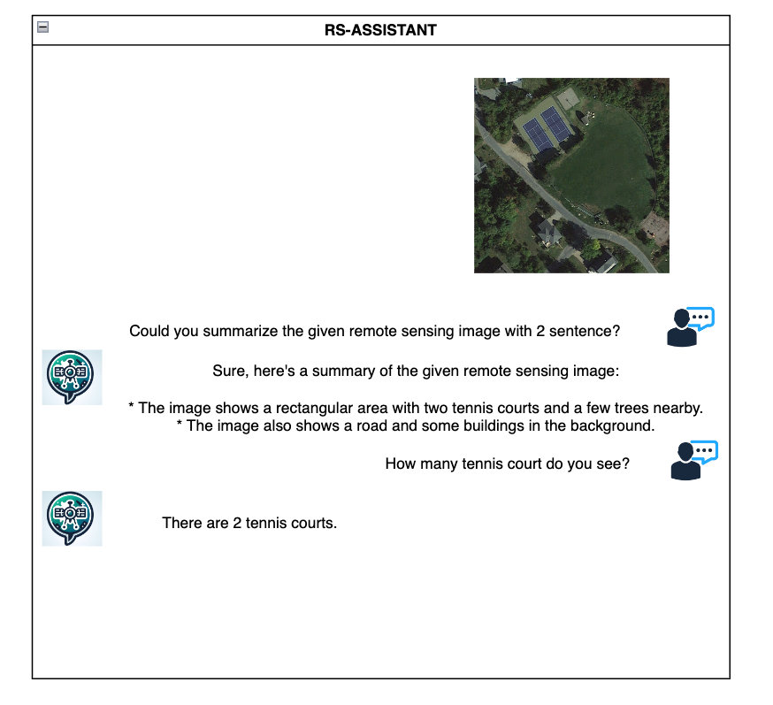

# Remote Sensing Dataset Construction

### Vision Language Dataset Construction Library

- [Dataset](https://huggingface.co/datasets/eneskaranfil/remote-sensing-instruction-tuning-dataset/tree/main)

Purpose of the repository construct codebase for feeding Foundation Model(FM) that we are going to build.

Instruction tuning and pretraining datasets will be shared soon via the Google Drive API. This will include access for those who typically seek datasets provided through Chinese domains like Pan.baidu.

Inspired by the MM-LLM Pretraining paper by Apple (https://arxiv.org/abs/2403.09611), I have integrated several filter options into our pretraining process. These enhancements are expected to significantly improve the performance of our pretraining model.

### RS-Assistant 

## Visual Grounding Datasets

| Dataset Type       | Dataset Name    | Status | Number of Samples |
|--------------------|-----------------|--------|-------------------|
| Visual Grounding   | DIOR-RSVG       | done   | 17.4k             |

## Captioning Datasets

| Dataset Type       | Dataset Name    | Status | Number of Samples |
|--------------------|-----------------|--------|-------------------|
| Captioning Dataset | RSICD           | done   | 10.9k             |
| Captioning Dataset | LAION5B         | done   | 10.9k             |
| Captioning Dataset | UCM Captions    | done   | 2.1k              |
| Captioning Dataset | CapERA          | done   | 1.4k              |
| Captioning Dataset | RSITMD          | done   | 4.7k              |

## VQA Datasets

| Dataset Type       | Dataset Name    | Status | Number of Samples |
|--------------------|-----------------|--------|-------------------|
| VQA Dataset        | FloodNet        | done   | 1.4k              |
| VQA Dataset        | RSVQAxBEN       | done   | 590k              |
| VQA Dataset        | RSVQA HR        | done   | 10.6k             |
